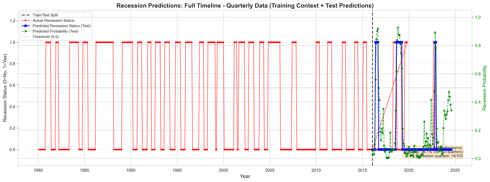
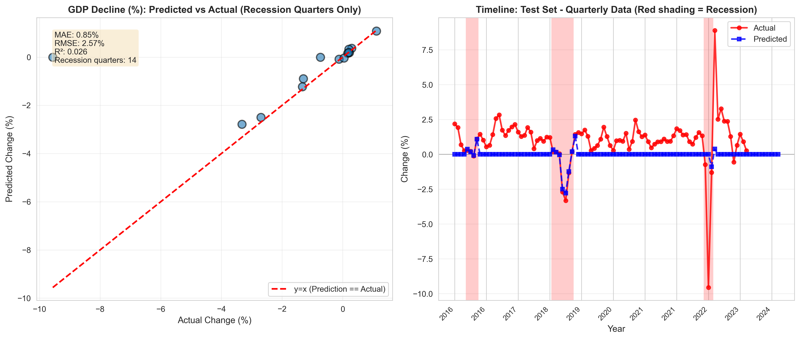
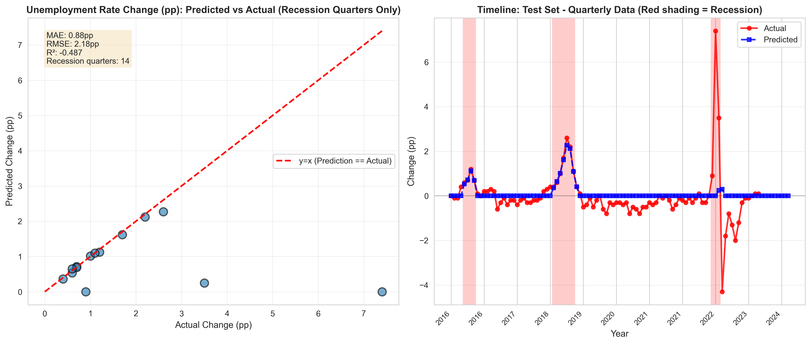
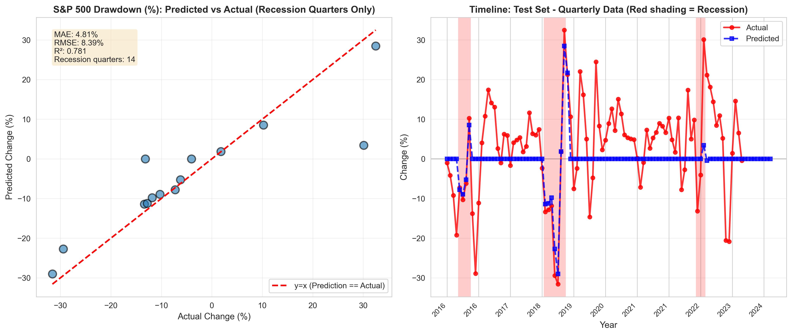

# US Recession Indicators Risk Model

Risk model predicts recession **probability** (on a quarterly basis) and **forecasts** economic indicators  during recessionary periods using 170+ years of economic data (1854-2025).

## Overview

This project builds a hybrid recession prediction system by analyzing 27 economic indicators spanning over 170 years. The system uses a two-stage architecture:

**Stage 1**: Predict recession probability for the next few quarters

**Stage 2**: If a recession is forecasted, Also Forecast economic indicator changes during recession (unemployment, stock markets, GDP)

The system processes raw economic data through a sophisticated [feature engineering pipeline](#-feature-engineering), creating over 5,000 predictive features before selecting the most informative ones for [model training](#️-model-architecture). See [Results](#-results-on-test-set) for model performance on test data. 

### Prediction Outputs

1. **Recession Probability**: Binary classification with calibrated probabilities (0-1)
2. **Economic Impact Forecasts** (conditional on recession):
   - **Labor Market**: Unemployment rate change, unemployment claims change
   - **Stock Markets**: S&P 500 drawdown, NASDAQ drawdown
   - **Economic Output**: GDP decline

**Dataset**: [US Recession and Financial Indicators](https://www.kaggle.com/datasets/mikoajfish99/us-recession-and-financial-indicators/data) from Kaggle
- 27 economic indicators (Federal funds rate, GDP, unemployment, credit, money supply, real estate, stock markets)
- 685 quarterly observations (1854-2025)
- 214 recession quarters (31.2% of data)
- **Training data**: 172 samples (1980-2023) with complete regression targets

### Model Performance Summary

- **Test ROC-AUC**: 0.819 (recession classification)
- **Test Recall**: 67% (catches 2 of 3 recessions)
- **Test Specificity**: 92% (low false alarm rate)
- **Inference Speed**: <30ms per prediction

---

## 🎯 Results on Test Set

### Recession Predictions: Full Timeline



Quarterly recession predictions with full historical context (1980-2024):
- **Red shading**: Actual recession periods
- **Blue squares**: Model predictions on test set (2016-2023)
- **Green line**: Prediction probabilities (secondary axis)
- **Black dashed line**: Train/test split

### Economic Indicator Predictions During Recessions

#### GDP Decline Predictions



#### Unemployment Rate Change Predictions



#### S&P 500 Drawdown Predictions



Each plot shows:
- **Left**: Scatter plot for recession quarters only with y=x line and metrics (MAE, RMSE, R²)
- **Right**: Timeline showing predictions (blue) vs actual (red) with recession periods shaded

**📊 For all visualizations and detailed analysis, see [reports/report.md](reports/report.md)**

---

## 🎯 Feature Engineering

We transform 27 raw economic indicators into predictive features through a sophisticated pipeline:

### Quick Summary

- **Input**: 27 economic indicators, 685 quarters (1854-2025)
- **Engineered**: 5,416 features (lags, rolling stats, differences, ratios, technical indicators)
- **Selected**: 29 final features via Random Forest importance + VIF filtering
- **Key Features**: Historical recession patterns, Fed Funds Rate, GDP, Unemployment

### Feature Categories

| Category | Count | Examples |
|----------|-------|----------|
| **Lag Features** | 135 | `GDP_lag_1`, `Unemployment_lag_4` |
| **Rolling Statistics** | 270 | `GDP_rolling_4q_mean`, `SPX500_rolling_8q_std` |
| **Difference Features** | 54 | `GDP_diff_qoq`, `Unemployment_diff_yoy` |
| **Economic Ratios** | 15+ | `buffett_indicator_sp500`, `money_velocity_m1` |
| **Technical Indicators** | 30 | `rsi_14_SPX500`, `macd_line_NASDAQ` |
| **Interactions** | 4,912+ | Various complex features |

**🔧 For detailed feature engineering pipeline, categories, and selection process, see [src/features/features.md](src/features/features.md)**

---

## 🏗️ Model Architecture

### Selected Model: XGBoost Two-Stage Hybrid System

After comparing 3 different Stage 1 classifiers (XGBoost, Random Forest, Logistic Regression), we selected **XGBoost** for its superior recall (67% vs 33%) and balanced performance.

```
┌─────────────────────────────────────────────────────────────────────┐
│                    HYBRID RECESSION PREDICTOR                        │
│                                                                      │
│  INPUT: 29 Selected Features (economic indicators + engineered)     │
│                              ↓                                       │
│  ┌────────────────────────────────────────────────────────┐        │
│  │         STAGE 1: RECESSION CLASSIFIER                  │        │
│  │  ┌──────────────────────────────────────────────────┐  │        │
│  │  │  XGBoost Binary Classifier                       │  │        │
│  │  │  - Input: 29 features                            │  │        │
│  │  │  - Output: Recession probability [0-1]           │  │        │
│  │  │  - Calibrated probabilities (CalibratedCV)       │  │        │
│  │  └──────────────────────────────────────────────────┘  │        │
│  └────────────────────────────────────────────────────────┘        │
│                              ↓                                       │
│              Recession Probability >= Threshold?                    │
│                              ↓                                       │
│                     YES → Activate Stage 2                          │
│                     NO  → Return probability only                   │
│                              ↓                                       │
│  ┌────────────────────────────────────────────────────────┐        │
│  │         STAGE 2: INDICATOR REGRESSORS                  │        │
│  │  (Conditional - only when recession likely)            │        │
│  │                                                         │        │
│  │  ┌─────────────────────────────────────────┐           │        │
│  │  │  Labor Regressor (Multi-Output XGBoost) │           │        │
│  │  │  → Unemployment rate change             │           │        │
│  │  │  → Unemployment claims change           │           │        │
│  │  └─────────────────────────────────────────┘           │        │
│  │                                                         │        │
│  │  ┌─────────────────────────────────────────┐           │        │
│  │  │  Markets Regressor (Multi-Output XGBoost)│          │        │
│  │  │  → S&P 500 drawdown                     │           │        │
│  │  │  → NASDAQ drawdown                      │           │        │
│  │  └─────────────────────────────────────────┘           │        │
│  │                                                         │        │
│  │  ┌─────────────────────────────────────────┐           │        │
│  │  │  GDP Regressor (XGBoost)                │           │        │
│  │  │  → GDP decline (%)                      │           │        │
│  │  └─────────────────────────────────────────┘           │        │
│  └────────────────────────────────────────────────────────┘        │
│                              ↓                                       │
│  OUTPUT:                                                            │
│  - Recession probability: 0.82                                      │
│  - Recession predicted: True                                        │
│  - Indicator impacts:                                               │
│      • Unemployment rate: +2.1pp                                    │
│      • Unemployment claims: +45%                                    │
│      • S&P 500 drawdown: -18%                                       │
│      • NASDAQ drawdown: -22%                                        │
│      • GDP decline: -3.5%                                           │
└─────────────────────────────────────────────────────────────────────┘
```

**🏗️ For key design decisions, model comparison, and detailed performance metrics, see [models/models.md](models/models.md)**

---

## 🔧 Usage

## 📁 Project Structure

```
.
├── config.yaml                # Project configuration (paths, model hyperparams)
├── pyproject.toml            # Python package config and tool settings
├── Makefile                  # Convenient command shortcuts
├── CLAUDE.md                 # Claude Code instructions
├── IMPLEMENTATION_ROADMAP.md # Full implementation plan
├── data/
│   ├── raw/                 # Raw data from Kaggle (not in git)
│   ├── processed/           # Preprocessed data (not in git)
│   │   ├── quarterly_aligned.parquet
│   │   ├── features_full.parquet       (5,416 features)
│   │   └── features_selected.parquet   (29 features + 9 targets)
│   └── external/            # External data sources
├── docs/                    # Technical documentation
│   ├── methodology.md       # Technical methodology and design decisions
│   └── data_dictionary.md   # Complete data dictionary (27 indicators)
├── models/                  # Saved models (not in git)
│   ├── models.md            # Model evaluation and performance metrics
│   ├── best_model/
│   │   ├── hybrid_recession_model.joblib
│   │   ├── hybrid_recession_model_metadata.json
│   │   └── metrics.json
│   └── run_YYYYMMDD_HHMMSS/
│       ├── hybrid_recession_model.joblib
│       ├── hybrid_recession_model_metadata.json
│       └── metrics.json
├── reports/                 # Generated reports and figures
│   ├── report.md                         # Visualization documentation
│   ├── model_comparison.csv              # Phase 4 model comparison results
│   └── figures/                           # Static visualizations (PNG)
│       ├── model_comparison_metrics.png
│       ├── recession_predictions_full_timeline.png
│       ├── indicator_*.png               # 5 individual indicator plots
│       └── all_indicators_comparison.png
├── entrypoint/              # Entry point scripts
│   ├── fetch_nber.py       # Fetch NBER recession data
│   ├── preprocess.py       # Process 27 CSVs to quarterly
│   ├── engineer_features.py # Feature engineering pipeline
│   ├── train.py            # Train hybrid model
│   ├── compare_models.py   # Compare Stage 1 classifiers (Phase 4)
│   ├── visualize_model_comparison.py   # Generate model comparison plots
│   └── visualize_test_predictions.py   # Generate test set prediction plots
├── logs/
│   ├── train.log           # Training logs
│   ├── compare_models.log  # Model comparison logs
│   └── visualize.log       # Visualization generation logs
├── src/                    # Source code modules
│   ├── data/              # Data loading and processing
│   │   ├── loader.py
│   │   ├── nber_fetcher.py
│   │   ├── preprocessor.py
│   │   └── validator.py
│   ├── features/          # Feature engineering
│   │   ├── features.md    # Feature engineering documentation
│   │   ├── engineer.py
│   │   ├── selector.py
│   │   └── targets.py
│   ├── models/            # Model implementations
│   │   ├── base.py                # Abstract base classes
│   │   ├── recession_classifier.py # Stage 1 models (XGBoost, RF, Logistic)
│   │   ├── indicator_regressors.py # Stage 2 models
│   │   ├── hybrid_predictor.py    # Orchestrator
│   │   ├── evaluator.py           # Evaluation framework
│   │   └── model_persistence.py   # Save/load utilities
│   ├── visualization/     # Visualization modules
│   │   └── static_plots.py        # Static plot generation
│   └── utils/             # Utilities
│       ├── config.py
│       └── logger.py
└── tests/                 # Unit tests
    └── test_config.py
```

## Quick Start

### 1. Setup Environment

**Option A: Using UV (Recommended - faster)**
```bash
# Install dependencies with UV
uv sync --all-extras

# UV automatically manages the virtual environment
```

**Option B: Using pip**
```bash
# Create virtual environment
python -m venv venv
source venv/bin/activate  # On Windows: venv\Scripts\activate

# Install with development tools
make install-dev
```

### 2. Configure Kaggle API

1. Create account at https://www.kaggle.com
2. Go to Account → Settings → API → Create New Token
3. Download `kaggle.json` from Kaggle account settings
4. Save to `~/.kaggle/kaggle.json`
5. Set permissions (Mac/Linux): `chmod 600 ~/.kaggle/kaggle.json`

### 3. Download Data

```bash
make data
```

Or manually download from [Kaggle](https://www.kaggle.com/datasets/mikoajfish99/us-recession-and-financial-indicators/data) and place in `data/raw/`.

### 4. Engineer Features

Transform raw economic indicators into predictive features:

```bash
python entrypoint/engineer_features.py
```

**Output**:
- Creates 5,416 features from 27 indicators
- Selects top 29 features via Random Forest + VIF
- Saves processed data to `data/processed/`:
  - `features_full.parquet` (13.04 MB - all 5,416 features)
  - `features_selected.parquet` (0.07 MB - final 29 features ready for training)
  - `feature_importance.csv` (feature rankings)

**Execution Time**: ~2-5 minutes

### 5. Train Model

Start with the complete training pipeline:

```bash
# 1. Train single model (XGBoost by default)
python entrypoint/train.py

# Output:
# - Trains hybrid model (Stage 1 + Stage 2)
# - Evaluates on train/val/test splits
# - Saves model to models/run_YYYYMMDD_HHMMSS/
# - Generates metrics.json with all evaluation results

# 2. Compare multiple Stage 1 classifiers (Phase 4)
python entrypoint/compare_models.py

# Output:
# - Trains XGBoost, Random Forest, and Logistic Regression
# - Compares all models on test set
# - Saves comparison to reports/model_comparison.csv
# - Saves all trained models

# 3. Generate model comparison visualizations
python entrypoint/visualize_model_comparison.py

# Output:
# - Generates 5 model comparison plots in reports/figures/
# - Requires model_comparison.csv and feature_importance.csv

# 4. Generate test set prediction visualizations
python entrypoint/visualize_test_predictions.py

# Output:
# - Generates 7 prediction plots in reports/figures/
# - Requires trained model and test data
```

### Making Predictions

```python
from src.models.model_persistence import load_model
import pandas as pd

# Load trained model
model, metadata = load_model("models/run_20251130_142214/")

# Prepare features (same 29 features used in training)
X_new = pd.DataFrame({...})  # Your 29 features

# Predict
predictions = model.predict(X_new)

# Access results
print(f"Recession probability: {predictions['recession_probability'][0]:.2%}")
print(f"Recession predicted: {predictions['recession_predicted'][0]}")

if predictions['indicator_impacts'] is not None:
    impacts = predictions['indicator_impacts'].iloc[0]
    print(f"Unemployment rate change: {impacts['unemployment_rate_change']:.1f}pp")
    print(f"S&P 500 drawdown: {impacts['sp500_drawdown']:.1f}%")
    # ... more indicators
```

### Single Sample Prediction

```python
# Convenience method for single prediction
single_pred = model.predict_single(X_new.iloc[:1])

print(f"Date: {single_pred['date']}")
print(f"Recession probability: {single_pred['recession_probability']:.2%}")
print(f"Predicted: {single_pred['recession_predicted']}")

if single_pred['indicator_impacts']:
    for indicator, value in single_pred['indicator_impacts'].items():
        print(f"{indicator}: {value:.2f}")
```

### Customizing Hyperparameters

Edit `config.yaml` to adjust model configuration:

```yaml
model:
  threshold: 0.5  # Recession probability threshold

  stage1:
    classifier_type: xgboost  # Options: xgboost, random_forest, logistic
    hyperparameters:
      n_estimators: 200
      max_depth: 6
      learning_rate: 0.05
      # ... more XGBoost params

  stage2:
    regressor_type: xgboost  # Options: xgboost, random_forest
    hyperparameters:
      n_estimators: 100
      max_depth: 5
      # ... more params
```

Then retrain with `python entrypoint/train.py`.

---


---

## 📚 Documentation

Comprehensive documentation is available in dedicated files for deeper technical details:

### Model Documentation
- **[models/models.md](models/models.md)** - Complete model evaluation and performance analysis
  - Model comparison across 3 Stage 1 classifiers (XGBoost, Random Forest, Logistic Regression)
  - Selection rationale and trade-off analysis
  - Stage 1 and Stage 2 performance metrics
  - Confusion matrices and feature importance
  - Embedded visualization figures for model comparison
  - Instructions to reproduce results

### Feature Engineering Documentation
- **[src/features/features.md](src/features/features.md)** - Detailed feature engineering pipeline
  - Complete feature engineering process (27 indicators → 5,416 features → 29 selected)
  - 6 feature categories with examples and formulations
  - Feature selection process (Random Forest + VIF)
  - Top 15 most important features with detailed analysis
  - Mathematical formulations for all transformations
  - Technical decisions and design rationale
  - Files generated and code structure

### Visualization Documentation
- **[reports/report.md](reports/report.md)** - Complete visualization guide
  - All 12 generated visualizations with descriptions
  - Model comparison plots (4 plots)
  - Feature importance visualization
  - Test set prediction plots (recession timeline + 5 indicator plots)
  - Combined indicators comparison grid
  - Interpretation guides for scatter plots, timelines, and metrics
  - Instructions to generate all visualizations

### Technical Documentation
- **[docs/methodology.md](docs/methodology.md)** - Technical methodology and design decisions
  - Theoretical background and approach
  - Mathematical formulations
  - Design choices and justifications
  - Validation strategies

- **[docs/data_dictionary.md](docs/data_dictionary.md)** - Complete data dictionary
  - All 27 economic indicators with definitions
  - Data sources and collection methodology
  - Units and temporal characteristics
  - Historical coverage for each indicator

---

## License

Database: Open Database, Contents: © Original Authors (Open Data Commons Open Database License 1.0)
