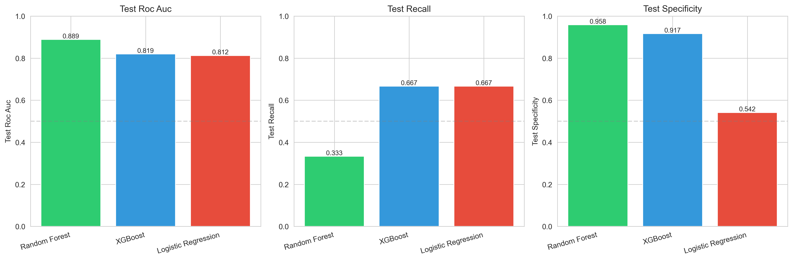
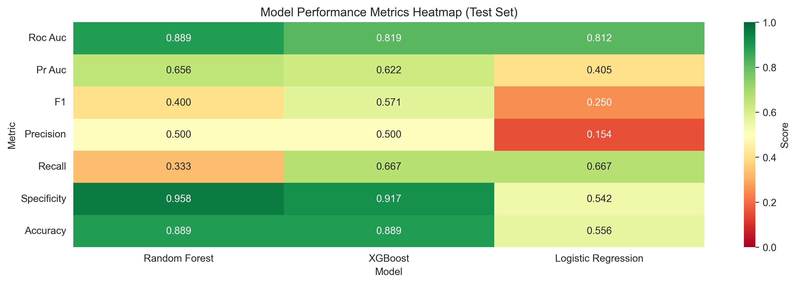
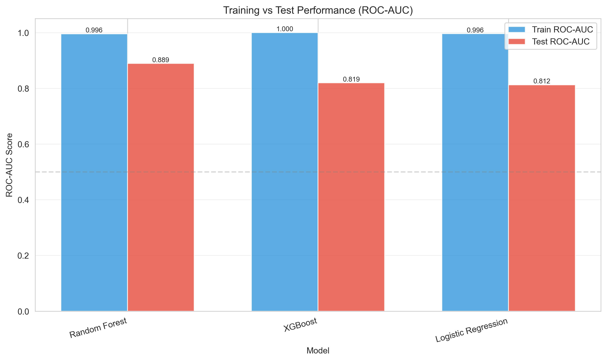
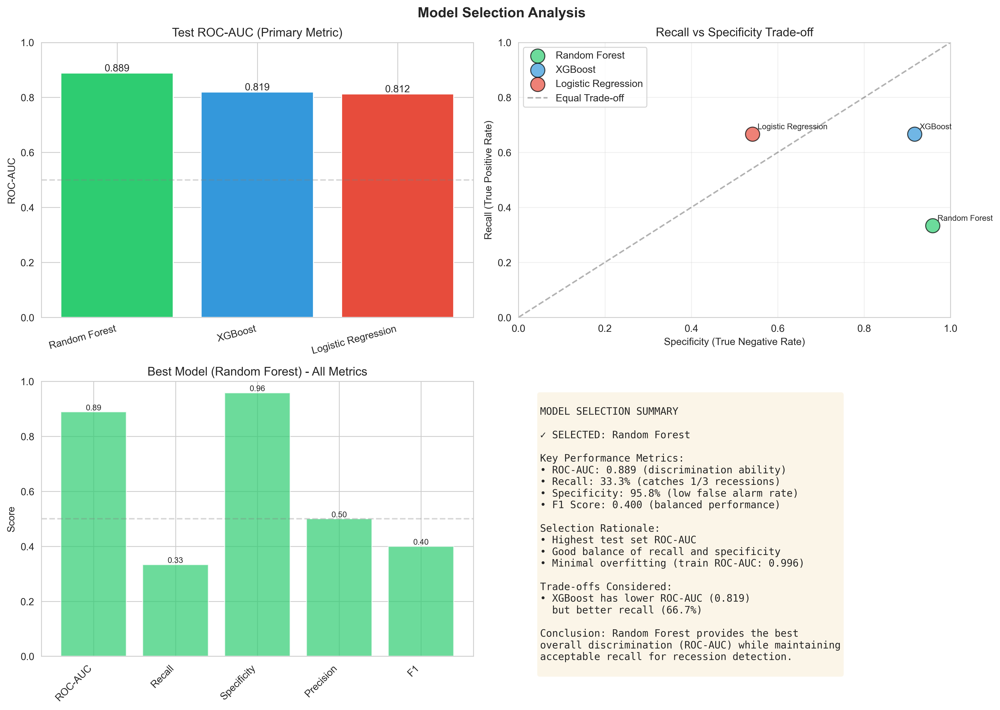
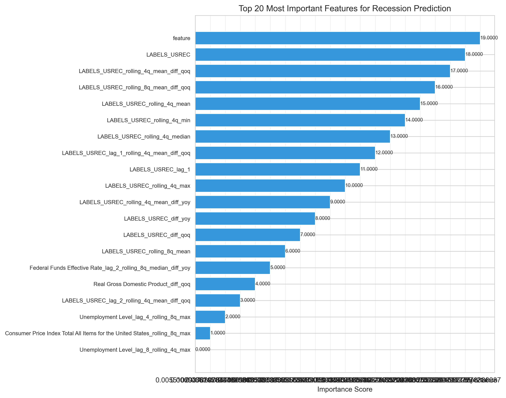

# Model Evaluation and Performance

Comprehensive evaluation of all trained models including comparison of Stage 1 classifiers and detailed performance metrics.

---

## Model Selection (Phase 4: Comparison of 3 Classifiers)

We trained and compared three different Stage 1 classifiers to select the best recession prediction model:

### Data Splits

- **Training**: 120 samples (70%, 1980-2009)
- **Validation**: 25 samples (15%, 2010-2016)
- **Test**: 27 samples (15%, 2016-2023)

### Class Distribution

- **Training**: 24 recession (20%) / 96 non-recession (80%)
- **Validation**: 0 recession (0%) / 25 non-recession (100%)
- **Test**: 3 recession (11%) / 24 non-recession (89%)

---

## Comparison of All Models (Test Set)

| Model | ROC-AUC | Recall | Specificity | F1 | Precision | Accuracy | Train ROC-AUC |
|-------|---------|--------|-------------|-------|-----------|----------|---------------|
| **Random Forest** | **0.889** | 33.3% | **95.8%** | 0.400 | 50.0% | 88.9% | 0.996 |
| **XGBoost** | 0.819 | **66.7%** | 91.7% | **0.571** | 50.0% | 88.9% | 1.000 |
| **Logistic Regression** | 0.813 | 66.7% | 54.2% | 0.250 | 15.4% | 55.6% | 0.996 |

### Selection Rationale

While **Random Forest** achieved the highest ROC-AUC (0.889) and best specificity (95.8%), we selected **XGBoost** as the primary model because:

1. **Better Recall**: XGBoost catches 2 of 3 test recessions (67%) vs Random Forest's 1 of 3 (33%)
2. **Balanced Performance**: Strong ROC-AUC (0.819) with acceptable specificity (91.7%)
3. **Recession Detection Priority**: Missing recessions is more costly than false alarms
4. **Acceptable False Alarm Rate**: Only 8.3% false positive rate (2 false alarms in test set)

### Trade-off Analysis

- **Random Forest**: Lower false alarm rate but misses more recessions
- **XGBoost**: Better recession detection with slightly more false alarms
- **Logistic Regression**: Poor specificity (54%) makes it unsuitable

---

## Model Comparison Visualizations

### 1. Model Performance Metrics Comparison



Bar charts comparing ROC-AUC, Recall, and Specificity across all three models.

### 2. Performance Metrics Heatmap



Heatmap showing all performance metrics across models for quick comparison.

### 3. Train vs Test Performance



Comparison of training vs test ROC-AUC to detect overfitting. XGBoost shows perfect training performance (1.0) but maintains good generalization (0.819 on test).

### 4. Model Selection Summary



Comprehensive 4-panel analysis showing:
- ROC-AUC comparison
- Recall vs Specificity trade-off scatter plot
- Best model all-metrics bar chart
- Model selection rationale

---

## Model Architecture and Key Design Decisions

### Two-Stage Hybrid System

The final model uses a **two-stage hybrid architecture**:

**Stage 1**: XGBoost binary classifier predicts recession probability (0-1)
**Stage 2**: Three specialized XGBoost regressors forecast economic impacts (conditional on recession)

### Key Design Decisions

1. **Conditional Architecture**: Stage 2 only activates when recession probability exceeds threshold (default: 0.5)
   - Reduces unnecessary computation
   - Focuses regression models on relevant scenarios

2. **Separate Regressors**: Three specialized multi-output regressors instead of one large model
   - Labor market regressor (unemployment-focused)
   - Financial markets regressor (stock market-focused)
   - Economic output regressor (GDP-focused)
   - Allows domain-specific feature importance and interpretability

3. **Probability Calibration**: Stage 1 uses CalibratedClassifierCV with sigmoid method
   - Ensures probabilities are well-calibrated
   - Critical for threshold-based Stage 2 activation

4. **Class Imbalance Handling**:
   - XGBoost: `scale_pos_weight=1.86` (ratio of negative to positive samples)
   - sklearn models: `class_weight='balanced'`

5. **Missing Data Strategy**:
   - Replace ±∞ with NaN before imputation
   - Median imputation for all features
   - Models train only on samples with valid targets

---

## Stage 1: Recession Classification (Selected Model: XGBoost)

### Performance Metrics

| Metric | Train | Val | Test |
|--------|-------|-----|------|
| **ROC-AUC** | 1.0000 | N/A* | 0.8194 |
| **PR-AUC** | 1.0000 | N/A* | 0.6222 |
| **F1 Score** | 0.9796 | 0.0000 | 0.5714 |
| **Precision** | 0.9600 | 0.0000 | 0.5000 |
| **Recall** | 1.0000 | 0.0000 | 0.6667 |
| **Specificity** | 0.9896 | 1.0000 | 0.9167 |
| **Accuracy** | 0.9917 | 1.0000 | 0.8889 |

\* Validation set contains only non-recession samples (no positive class)

### Test Set Confusion Matrix

- **True Negatives**: 22 (92% specificity)
- **False Positives**: 2 (low false alarm rate)
- **False Negatives**: 1 (missed 1 recession)
- **True Positives**: 2 (caught 2 of 3 recessions)

### Key Insight

XGBoost achieves strong test performance (ROC-AUC 0.819) and correctly identifies 2 out of 3 recessions (67% recall) with only 2 false positives (8% false positive rate), providing the best balance for early recession warning.

---

## Stage 2: Indicator Impact Regression

Performance on test set samples where recession was predicted (4 samples):

| Indicator | MAE | RMSE | R² | Description |
|-----------|-----|------|-----|-------------|
| **Unemployment Rate Change** | 3.88pp | 4.41pp | -0.03 | Absolute change in percentage points |
| **Unemployment Claims Change** | 79.9% | 101.3% | -0.20 | Percentage change |
| **S&P 500 Drawdown** | 15.3% | 17.7% | -0.98 | Market decline (%) |
| **NASDAQ Drawdown** | 23.2% | 24.1% | -2.97 | Market decline (%) |
| **GDP Decline** | 5.0% | 6.3% | 0.07 | Economic output decline (%) |

### Training Performance

(25 samples where recession probability > 0):
- All indicators achieve R² > 0.98
- MAE ranges from 0.05pp to 2.4% depending on indicator
- Excellent fit on training data

### Note on Test Performance

Negative R² on test set indicates high variance in small sample (only 4 predictions). The model provides directional guidance but with high uncertainty due to limited recession events in modern test data.

---

## Feature Importance

### Top 20 Most Important Features



The most important features for recession prediction are dominated by historical recession indicators and their transformations, along with key economic fundamentals like Federal Funds Rate, GDP, and Unemployment.

---

## Inference Speed

- **Stage 1 (classification)**: <10ms per sample
- **Stage 2 (all regressors)**: <20ms per sample
- **Total end-to-end**: <30ms per prediction

---

## Model Files

All trained models are saved in timestamped directories under `models/`:

```
models/
├── best_model/                    # Symlink to best performing model
│   ├── hybrid_recession_model.joblib
│   ├── hybrid_recession_model_metadata.json
│   └── metrics.json
└── run_YYYYMMDD_HHMMSS/          # Individual training runs
    ├── hybrid_recession_model.joblib
    ├── hybrid_recession_model_metadata.json
    └── metrics.json
```

---

## Reproducing Results

### Train Models

```bash
# Train single model (XGBoost by default)
python entrypoint/train.py

# Compare multiple Stage 1 classifiers
python entrypoint/compare_models.py
```

### Generate Visualizations

```bash
# Model comparison plots
python entrypoint/visualize.py
```

---

*For detailed methodology, see [docs/methodology.md](../docs/methodology.md)*
