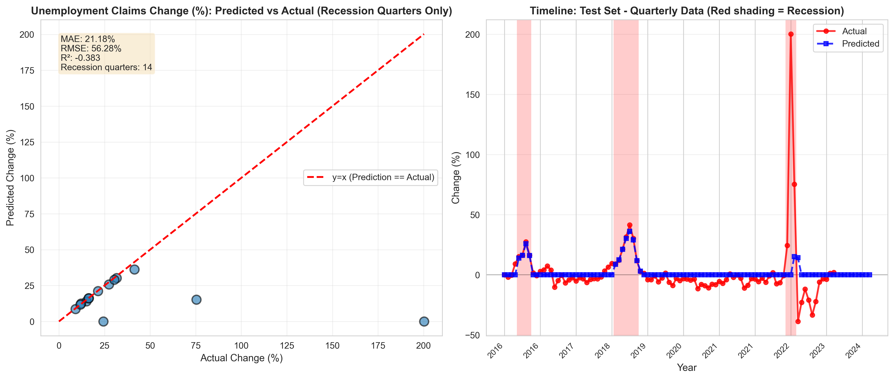
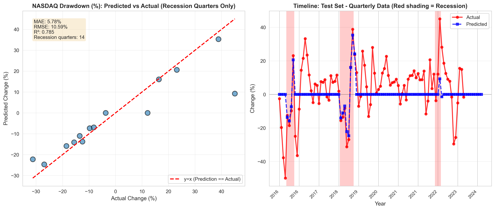
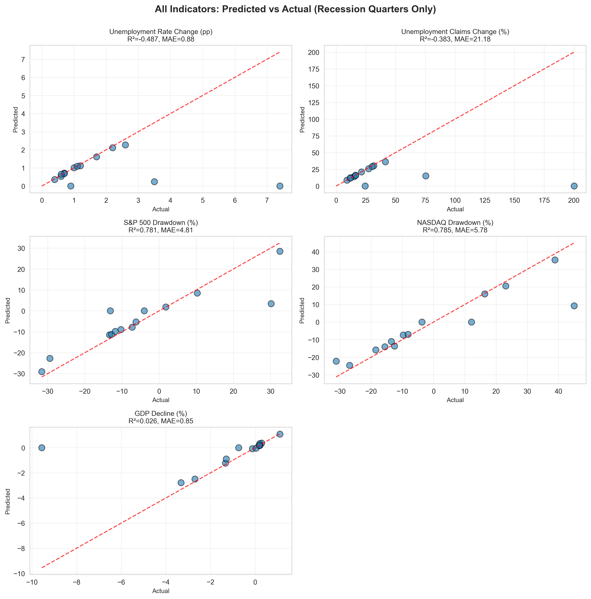

# Visualization Report

Complete documentation of all visualizations generated for the recession prediction model, including model comparison plots, feature analysis, and test set prediction results.

---

## Overview

Static visualizations generated for model analysis and reporting are available in `reports/figures/`. All visualizations are publication-ready (300 DPI) and generated using matplotlib/seaborn.

---

## Model Comparison Visualizations

### 1. Model Performance Metrics Comparison

**File**: `model_comparison_metrics.png`


Bar charts comparing ROC-AUC, Recall, and Specificity across all three Stage 1 classifiers:
- Random Forest
- XGBoost
- Logistic Regression

### 2. Performance Metrics Heatmap

**File**: `model_metrics_heatmap.png`


Heatmap showing all performance metrics across models for comprehensive comparison:
- ROC-AUC, PR-AUC
- Precision, Recall, Specificity
- F1 Score, Accuracy

### 3. Train vs Test Performance

**File**: `train_vs_test_performance.png`


Comparison of training vs test ROC-AUC to detect overfitting. Shows:
- Training performance (blue bars)
- Test performance (red bars)
- Gap between train/test indicates overfitting risk

### 4. Model Selection Summary

**File**: `model_selection_summary.png`


Comprehensive 4-panel analysis showing:
- **Top Left**: ROC-AUC comparison across models
- **Top Right**: Recall vs Specificity trade-off scatter plot
- **Bottom Left**: Best model (XGBoost) all-metrics bar chart
- **Bottom Right**: Model selection rationale text box

---

## Feature Analysis

### 5. Feature Importance (Top 20)

**File**: `feature_importance_top20.png`


Horizontal bar chart showing the top 20 most important features for recession prediction. Features are ranked by importance score from a Random Forest model.

**Key Findings**:
- Historical recession indicators (`LABELS_USREC` and its transformations) dominate
- Economic fundamentals (Federal Funds Rate, GDP, Unemployment) also highly important
- Temporal features (lags, rolling averages) capture recession patterns

---

## Test Set Predictions (Predicted vs Actual)

### 6. Recession Predictions: Full Timeline

**File**: `recession_predictions_full_timeline.png`


Full recession prediction timeline showing quarterly data with:
- **Training context**: Historical actual recessions (1980-2016) with light red shading
- **Train/test split**: Vertical dashed black line marking the split
- **Actual recession status**: Red circles (full timeline)
- **Test predictions**: Blue squares showing predicted recession status
- **Prediction probabilities**: Green dashed line (secondary y-axis) showing model confidence
- **Threshold line**: Green dotted line at 0.5 probability

**Purpose**: Shows how well the model predicts recessions compared to historical patterns and provides full temporal context.

---

## Individual Indicator Predictions

Each indicator plot shows two panels:
- **Left**: Scatter plot of recession quarters only with y=x line and metrics (MAE, RMSE, R²)
- **Right**: Timeline of all test samples showing actual (red) vs predicted (blue) with recession periods shaded

### 7. Unemployment Rate Change

**File**: `indicator_unemployment_rate_change_pp.png`


Predicted vs actual unemployment rate change (percentage points) during recessions.

### 8. Unemployment Claims Change

**File**: `indicator_unemployment_claims_change_pct.png`



Predicted vs actual unemployment claims change (%) during recessions.

### 9. GDP Decline

**File**: `indicator_gdp_decline_pct.png`


Predicted vs actual GDP decline (%) during recessions.

### 10. S&P 500 Drawdown

**File**: `indicator_s&p_500_drawdown_pct.png`


Predicted vs actual S&P 500 market drawdown (%) during recessions.

### 11. NASDAQ Drawdown

**File**: `indicator_nasdaq_drawdown_pct.png`



Predicted vs actual NASDAQ market drawdown (%) during recessions.

---

## Combined Indicators Comparison

### 12. All Indicators Grid

**File**: `all_indicators_comparison.png`



Grid of scatter plots showing all 5 indicators' predicted vs actual values during recession quarters only. Each subplot includes:
- Scatter plot with y=x reference line
- R² and MAE metrics
- Recession quarters only (14 samples)

**Purpose**: Quick comparison of prediction quality across all economic indicators.

---

## How to Generate Visualizations

### Model Comparison Plots

Requires `model_comparison.csv` and `feature_importance.csv`:

```bash
python entrypoint/visualize_model_comparison.py
```

**Generates**:
- Model comparison metrics (bar charts)
- Metrics heatmap
- Train vs test comparison
- Model selection summary
- Feature importance plot

### Test Set Prediction Plots

Requires trained model and test data:

```bash
python entrypoint/visualize_test_predictions.py
```

**Generates**:
- Recession predictions full timeline
- 5 individual indicator prediction plots
- All indicators comparison grid

---

## Interpretation Guide

### Scatter Plots

- **Points on the y=x line**: Perfect predictions
- **Points above the line**: Model overpredicts (predicts larger changes than actual)
- **Points below the line**: Model underpredicts (predicts smaller changes than actual)
- **Clustering around line**: Good prediction accuracy

### Metrics

- **MAE (Mean Absolute Error)**: Average magnitude of prediction errors (lower is better)
- **RMSE (Root Mean Squared Error)**: Emphasizes larger errors (lower is better)
- **R² (Coefficient of Determination)**: Proportion of variance explained (1.0 is perfect, negative means worse than mean baseline)

### Timeline Plots

- **Red shading**: Actual recession periods
- **Red line**: Actual indicator values
- **Blue dashed line**: Model predictions
- **Convergence of lines**: Good prediction accuracy
- **Divergence of lines**: Prediction errors

---

## Data Characteristics

- **Frequency**: Quarterly economic data
- **Training period**: 1980-2009 (120 quarters)
- **Validation period**: 2010-2016 (25 quarters)
- **Test period**: 2016-2023 (27 quarters)
- **Recession quarters in test**: 14 out of 103 quarters (13.6%)
- **Sample size for scatter plots**: Only recession quarters (14 samples)

---

## Notes

- All visualizations use consistent color schemes for clarity
- Recession periods always shown with red shading
- Model predictions always shown in blue
- Actual values always shown in red
- All plots are saved at 300 DPI for publication quality

---

*For model evaluation details, see [models/models.md](../models/models.md)*

*For technical methodology, see [docs/methodology.md](../docs/methodology.md)*
